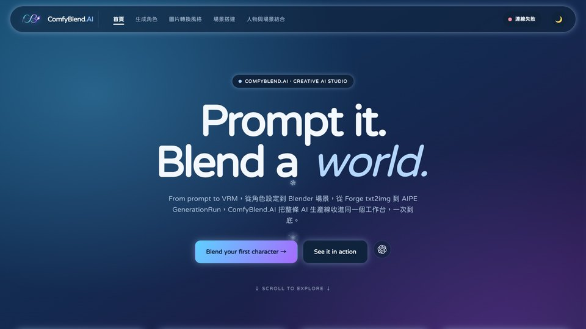
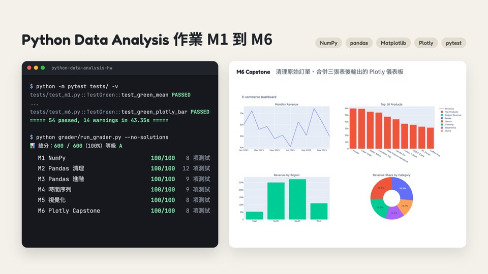

# 韻琴 Iris

Building AI tools for self-awareness, and writing tech notes anyone can read.

對諮商心理、人機互動與機器學習有興趣，正在開發支援心理覺察的 AI 互動工具。

## 作品

<table>
  <tr>
    <td width="50%" valign="top">
      
      <h3><a href="https://github.com/hsuiris/tomo-tutor-match">Tomo 家教媒合平台</a></h3>
      
家長發布家教需求、老師應徵，雙方可以比較條件、私訊和互評，另外有管理後台和時薪行情統計。

      
<a href="https://tutor-match-mu.vercel.app">線上網站</a> · Next.js · Prisma · PostgreSQL

    </td>
    <td width="50%" valign="top">
      
      <h3><a href="https://github.com/hsuiris/comfyblend">ComfyBlend.AI</a></h3>
      
把生成角色、四視圖、Blender 場景、插畫合成與風格轉換放進同一個網頁工作台，本機接 Stable Diffusion Forge 和 BlenderMCP 使用。

      
<a href="https://hsuiris.github.io/comfyblend/">線上看介面</a> · JavaScript · Python · Blender

    </td>
  </tr>
  <tr>
    <td width="50%" valign="top">
      
      <h3><a href="https://github.com/hsuiris/gre-vocab">GRE Vocab</a></h3>
      
GRE 單字複習 App，有選擇題、句子填空、手寫拼字，用 Leitner 盒子排複習時間，五個盒子的間隔從 1 天拉長到 14 天。

      
Expo · React Native · TypeScript

    </td>
    <td width="50%" valign="top">
      
      <h3><a href="https://github.com/hsuiris/titanic-ml-api">Titanic ML API</a></h3>
      
用鐵達尼號資料集做的 RESTful API 和儀表板，從資料 CRUD、特徵工程、五種模型比較，一路做到生還預測。

      
Flask · scikit-learn · XGBoost · SQLite

    </td>
  </tr>
  <tr>
    <td width="50%" valign="top">
      
      <h3><a href="https://github.com/hsuiris/tech-notes">tech-notes</a></h3>
      
給看不懂術語的人的 IT 白話筆記，教你看懂架構圖、錯誤訊息和專案資料夾，圖上的方塊都可以點開看說明。

      
<a href="https://hsuiris.github.io/tech-notes/">線上網站</a> · HTML · CSS · JavaScript

    </td>
    <td width="50%" valign="top">
      
      <h3><a href="https://github.com/hsuiris/python-data-analysis-hw">Python 資料分析作業</a></h3>
      
資料分析課 M1 到 M6 的作業，內容涵蓋 NumPy、pandas、時間序列和視覺化，GitHub Actions 自動批改拿到 600／600。

      
Python · pandas · Plotly · pytest

    </td>
  </tr>
</table>

## 常用技術

         
