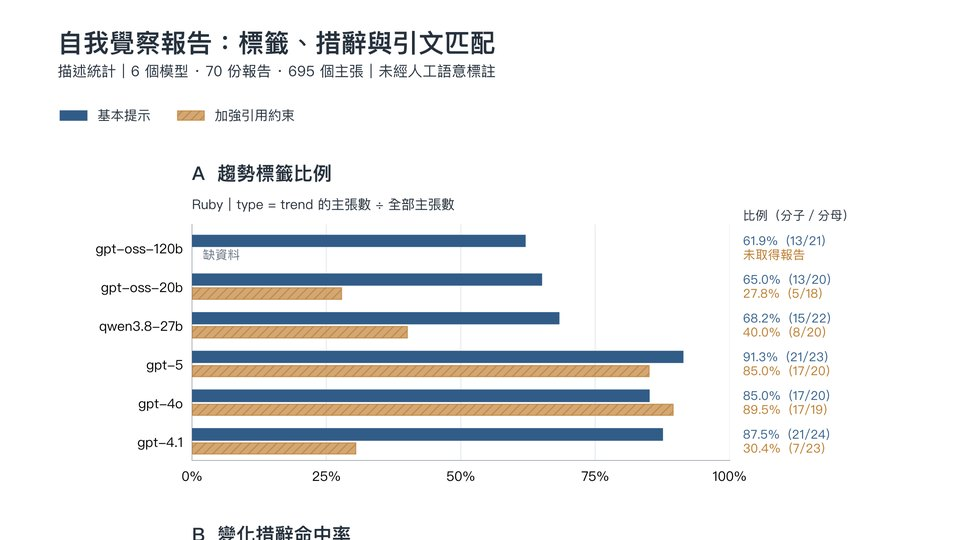
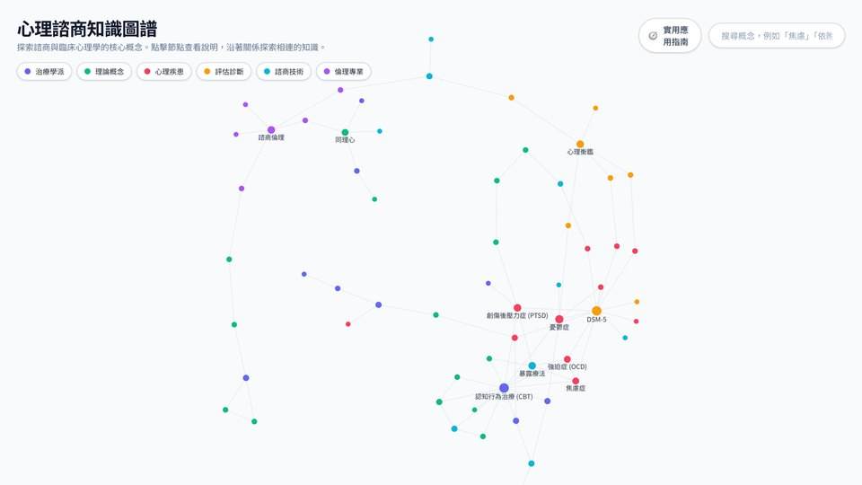
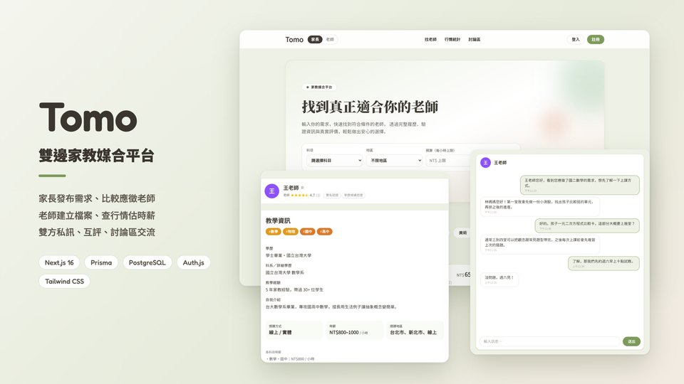
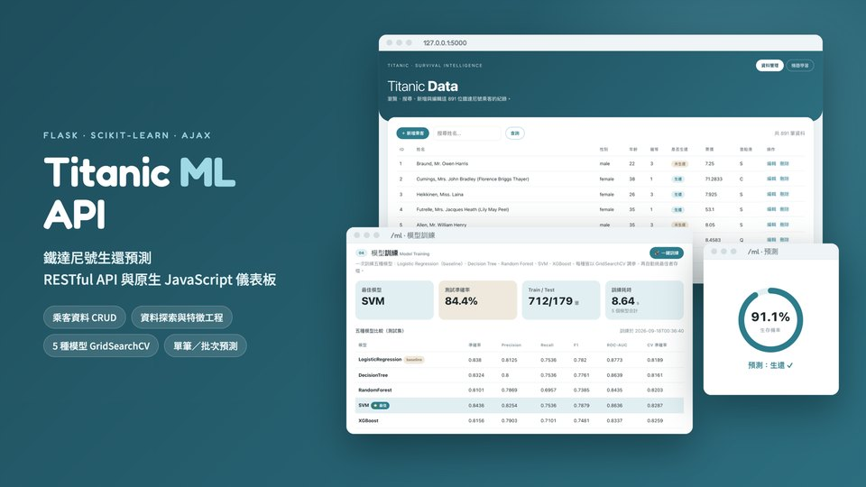
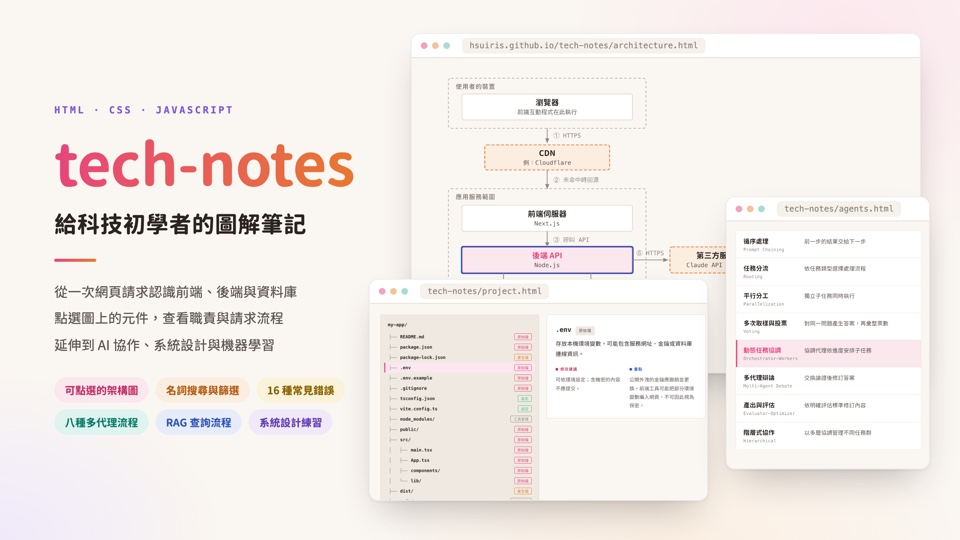

# 韻琴 Iris

Building AI tools for self-awareness, and writing tech notes anyone can read.

對諮商心理、人機互動與機器學習有興趣，正在開發支援心理覺察的 AI 互動工具。

## 作品

<table>
  <tr>
    <td width="50%" valign="top">
      
      <h3><a href="https://github.com/hsuiris/heartu">HeartU</a></h3>
      
心理覺察 App。報告只能引用日誌原文的逐字片段，引用在本機驗證，無法對應原文的內容不予顯示。內建本機危機偵測與台灣求助專線。

      
React Native · Expo · 33 個畫面 · 111 項測試

    </td>
    <td width="50%" valign="top">
      
      <h3><a href="https://github.com/hsuiris/insight-faithfulness">跨週自我覺察報告的忠實度</a></h3>
      
以一位三週日誌沒有方向性變化的虛構人物為對照組，量測模型是否仍宣稱有變化。六個模型、70 份報告、695 個主張，全自動評分。

      
研究 · LLM 評估 · Node.js

    </td>
  </tr>
  <tr>
    <td width="50%" valign="top">
      
      <h3><a href="https://github.com/hsuiris/psych-knowledge-graph">心理諮商知識圖譜</a></h3>
      
60 個諮商與臨床心理學概念、78 條關係。點選概念可查看說明，並沿著關係探索相連的知識。

      
<a href="https://hsuiris.github.io/psych-knowledge-graph/">線上網站</a> · Next.js · TypeScript

    </td>
    <td width="50%" valign="top">
      
      <h3><a href="https://github.com/hsuiris/tomo-tutor-match">Tomo 家教媒合平台</a></h3>
      
家長發布需求、老師應徵，雙方可以比較條件、私訊和互評，另有管理後台與時薪行情統計。

      
<a href="https://tutor-match-mu.vercel.app">線上網站</a> · Next.js · Prisma · PostgreSQL

    </td>
  </tr>
  <tr>
    <td width="50%" valign="top">
      
      <h3><a href="https://github.com/hsuiris/titanic-ml-api">Titanic ML API</a></h3>
      
涵蓋資料 CRUD、特徵工程、五種模型比較與生還預測的 RESTful API 與儀表板。

      
Flask · scikit-learn · XGBoost

    </td>
    <td width="50%" valign="top">
      
      <h3><a href="https://github.com/hsuiris/tech-notes">tech-notes</a></h3>
      
給看不懂術語的人的 IT 白話筆記。看懂架構圖、錯誤訊息、專案資料夾，圖上的方塊都可以點開看說明。

      
<a href="https://hsuiris.github.io/tech-notes/">線上網站</a> · HTML · CSS · JavaScript

    </td>
  </tr>
</table>

其他：[GRE 單字 App](https://github.com/hsuiris/gre-vocab)（離線優先、3192 個字）、[ComfyBlend.AI](https://github.com/hsuiris/comfyblend)（AI 生產線工作台）、[Python 資料分析作業](https://github.com/hsuiris/python-data-analysis-hw)。

## 常用技術

         
